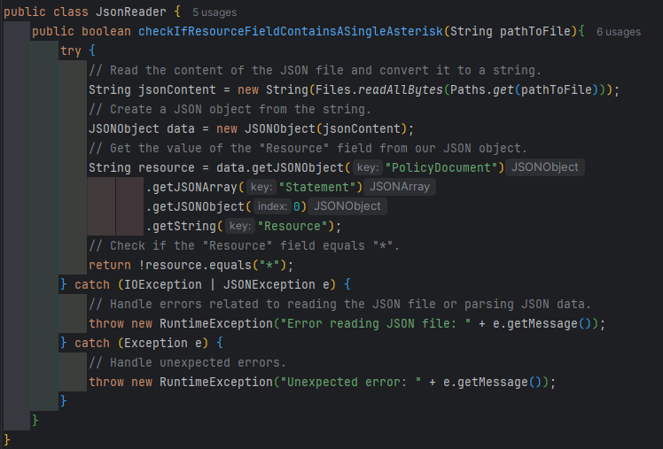
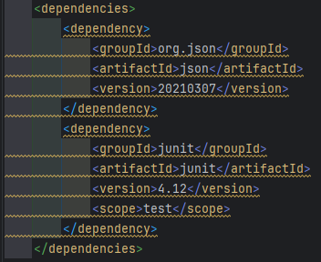

# Remitly intern task 2024 🖥

## The content of the task:
Write a method to verify the input JSON data. The input data format is defined as AWS::IAM::Role Policy. The input JSON might be read from a file.
The method shall return logical false if the input JSON Resource field contains a single asterisk and true otherwise.
## How to clone this project to your computer:
To run our program, you need to download a zip folder from my GitHub or clone this project to your local machine.
### Downloading a zip folder:
Once you have downloaded the zip, you need to unpack it. After that, navigate to the folder and open the pom.xml file using your preferred Java Integrated Development Environment (IDE), such as IntelliJ IDEA.
### Cloning with GitHub link:
Simply copy the link from here and paste it into your Git client.
After that, open the project in your IDE with version control capabilities.

## Running the program:
There are two ways to run the program: running tests and executing the main method.  
In the main, you have a simple way of using our method. You can edit it and try it in various ways.
By default, it uses the file SampleFileJson.json, but you can create your own files or modify existing ones.  
To run the tests, simply right-click the folder containing the tests. You will then see five passing tests for this project. Tests allow us to check if your method works correctly.

## What the method looks like:
  
Explaining how this method works is not necessary as everything is written in the comment above.
## The problem-solving process:
At the very beginning, we had to add Maven dependencies for JUnit for testing and JSON for reading JSON files.  
  
Then we could start writing our code. We began by creating a class and a method to check if our 'resources' field contains a single asterisk. 
Before diving into the implementation of the method, we switched to writing tests for the class to cover every possible scenario of our method's behavior.
### Here's how the tests looks like:

Once we had carefully considered all scenarios, we could write our method to pass all our unit tests. 
Finally, I created a simple outline of a main class that allows us to independently verify the functionality of the method.
### Here's how the main method looks like:

## Summary:
This exercise involved writing a method to verify JSON data, specifically focusing on the AWS IAM Role Policy format. The task required checking if the "Resource" field in the input JSON contains a single asterisk. The solution involved using Java and the JSONObject class from the org.json library to parse the JSON data.
### This task is that it combines several aspects:
Parsing JSON data: It provided an opportunity to work with JSON data and understand how to extract information from complex JSON structures.  
Error handling: The task required handling various exceptions that could occur during JSON parsing or file reading, ensuring robustness in real-world scenarios.  
Test-driven development: By writing tests before implementing the method, it ensured that the solution was thoroughly tested and met the expected requirements.  
Integration with Maven: The project utilized Maven for managing dependencies, making it easy to include external libraries like org.json for JSON processing.    
Overall, it was an engaging exercise that allowed for practical application of JSON parsing concepts within the context of AWS IAM policies.

